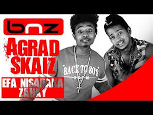

# Agrad

Agrad or Sitraka Andrianandraina
of his real name started to rap in 2006. He then met,
Tsiriniaina Rakotondranaly dit Skaiz in 2007 by joining the group Ny Foko
Ray. In 2010, the two left the Ny Foko Ray group. Agrad participated in a
freestyle competition and won the
first prize organized by the Gasy Ploit label in 2011. In 2012, the Agrad
& Skaiz group signed its contract with the label. Their first album entitled
"Hita wa" was released in August 2013, comprising 17 tracks including two interludes
and a bonus track.

**Genre:** Rap

**Artist homepage:** [https://www.acteur-fete.com/mg/p/agrad-skaiz-chanteur-d-antananarivo]
