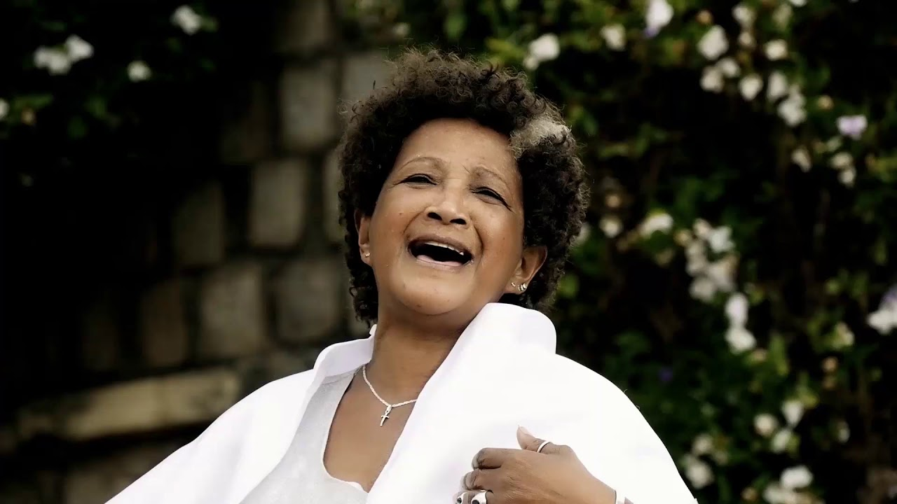

# Bakomanga

Led by Malagasy singer Mariette Rasoarinala, Groupe Bakomanga is known for performing traditional Merina songs and dance. Its repertoire draws from the hira gasy as well as other traditional and contemporary Merina genres that pay tribute to ancestors, usher in the harvest, and preserve Merina traditions.

**Genre:** Hira gasy

**Artist homepage:** [Bakomanga](https://www.madaplus.info/BAKOMANGA-A-NEW-YORK)
