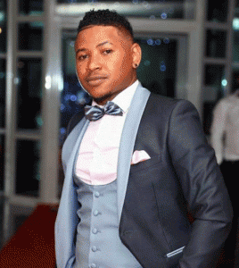

# Big mj

It is not from the South as Teta, but North of the Big Island as Wawa was born in effect Antalaha on Indian Ocean shores in 1987 and there was educated until tray. MJ: we immediately think a reference to Michael Jackson but it would have explained that these initials rather would put forward his skin color. His sense of rhythm, melody, good use of sounds of the Malagasy language to which he adds happily few words of French, his dancing abilities, charisma and toughness make it a real s urdoué of popular music,the singer who rose to Madagascar to the point that one wonders if it is not now the best Malagasy singer varieties activity. In this poor country that does not like to freeze in the gloom, it has the advantage of not taking themselves seriously and give to dance and have fun. Since joining in this business, the progress of this prolific self are staggering. Where does it stop?
It will be too quick to classify it into a musical genre because in fact it true pro of the many rhythms master dance salegy, Maloya , zouk, hip hop, rap, raegae, etc . It is far from Madagascan singers of the 70s and 80s and even some current artists like D'Gary or Theo Rakotovao rooted in their territory and heavily involved in social life. Many regret the appearances frimeu its superficial B ig MJ but the singer , always cheerful,seems to want a bite of life to the fullest and break from time to time with a heavy insularity. Its excellent melodies do the rest. The risk would be for him to fall into the ease and self-caricature. D years the video of his latest hit "  Aza atao forced  " filmed in Toamasina / Tamatave , m Miracle, the amateur side of his entourage added to his personal qualities save the day.

**Genre:** salegy

**Artist homepage:** [Big mj](http://www.midi-madagasikara.mg/culture/2019/10/10/big-mj-10-ans-de-scene-un-agenda-charge/)
