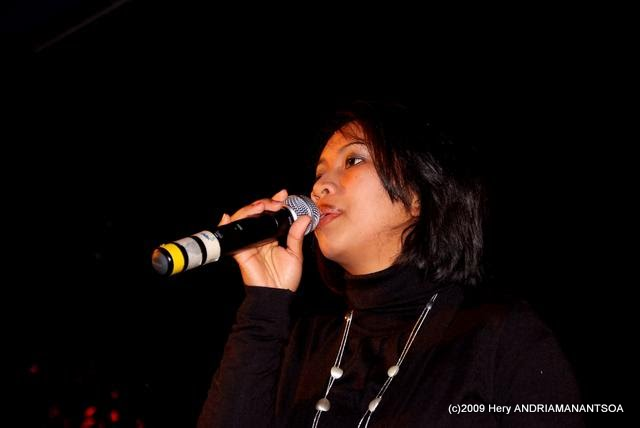

# Bodo

**Biography:**
**Bodoharisoa Razafindrazaka**, known as Bodo was born in 1966. She is a reference singer in Madagascar. As her amaizing styles, we call her the "Diva".

She started her music career in1986 and has created many songs. She also sometimes sings with some other sigers like Landy and Poopy.
Here is an extra information about her:
[Bodo](https://mg.wikipedia.org/wiki/Bodo_(mpihira))

**Genre:** slow

**Artist homepage:** [BODO](https://fr-fr.facebook.com/pg/Bododiva/about/?ref=page_internal)
