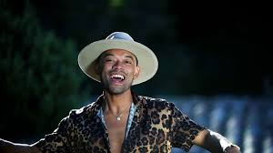

# D-lain

His real name is Ratolojanahary Lalaina Josia. He was born on 14 February 1987 in Ampanihy Ouest of Madagascar. He is songwriter. In 2012, he was selected to represent his country in the first season of Castel Live opera and won first prize against seven countries. Then moved to France for his album project, between Paris and La Corse, his place of residence.

Coming from a modest family, D-Lain obtained his baccalaureate and left the family home in 2005 to continue his studies in tourism and entrepreneurship in the capital, Antananarivo, and at the same time discovered a passion for song.

**Genre:** Pop

**Artist homepage:** [D-lain](https://fr-fr.facebook.com/DLainOfficiel/)
