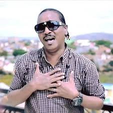

# Din Rotsaka

BEHARDISON Bernardin, known as Din Rotsaka is from BEFANDRIANA which is in the West coast of Madagascar. He started his music career at the age of 14.
He is also an outstanding man and he has even won the best Salegy drummer award from the Indian Ocean Festival  in 1999.

**Genre:** Salegy

**Artist homepage:** [Din Rotsaka](https://web.facebook.com/pg/DRKMDG/about/?ref=page_internal)
