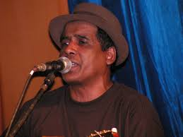

# Eric Manana

Erick Manana is an acoustic guitarist, singer and songwriter from Madagascar. He often performs in a duo or as a solo artist, singing in accompaniment to his acoustic guitar in the ba-gasy genre that gained prominence in the central highlands of Madagascar in the 1930s. Wikipedia
Born: 1959 (age 61 years), Madagascar

**Genre:** Salegy

**Artist homepage:** [Eric](https://www.google.com/search?q=erick+manana&sxsrf=ACYBGNTd-BamXIWo-a9lf5gztAZwTUuDuA:1580378860880&source=lnms&sa=X&ved=0ahUKEwiZ1vOEiqvnAhU68uAKHW_IC1QQ_AUIDSgA&biw=1366&bih=576&dpr=1)
