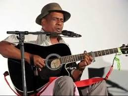

# Erick Manana

He was born in 1959 and started singing in 1986. He became famous in 1996 when recorded his first solo album. He is an acoustic guitarist, singer and songwriter. He often performs in a duo or as a solo artist, singing in accompaniment to his acoustic guitar in the ba-gasy genre that gained prominence in the central highlands of Madagascar in the 1930s.

**Genre:** Ba-gasy and Salegy

