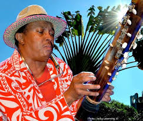

# Fenoaomby

In Malagasy, Fenoamby is the supernatural phenomenon like a person who has six fingers (see more) on each hand! and Paul Marius Fontaine alias (Fenoamby), the leader and singer of the group Fenoamby this real man orchestra is a sacred one !!!

Songwriter and poly-instrumentalists (Kabossy, Valiha, Marovany, Guitar and Harmonica, diatonic accordion, Blap, percussionist, drummer), Paul Marius Fontaine alias (Fenoamby) is from the North East of Madagascar. Born Ampanefena between Sambava and Vohémar. He started singing as a choirboy in the Catholic Church of Ampanefena and subsequently on drums at the age of 11 with the group Paroka which is found in the bush of Ampanefena (Ankotoba) a village of cultivators of vanilla, coffee, rice, breeder of Zebus ect. The distraction after work is to scratch the kabossy while singing about life, joy and love. Growing up, he frequented several ball orchestra groups such as The Thunders, The Spiders, Super-Jazz, Les 7 aigles, Les Anges noir, Tropical de Diégo.
Reunion Islander by adoption, charismatic singer with multiple registers, from lament to salegy (rhythm 6/8, the most popular in Madagascar) the most furious, passing by the reggassy (Malagasy reggae), the Maloya of the island of Reunion and Zulu rock from South Africa, he formed the group Fenoamby in the late 90s. 89
Recording five albums, Fenoamby quickly made a reputation throughout the Indian Ocean, pursued an international career and moved to France in 1998. Varying the rhythms, Fenoamby is the torchbearer of the Red Island Madagascar and more widely of the Indian Ocean.

**Genre:** Salegy and Reggrae Malagasy

**Artist homepage:** [Fenoaomby](http://www.fenoamby.com/)
