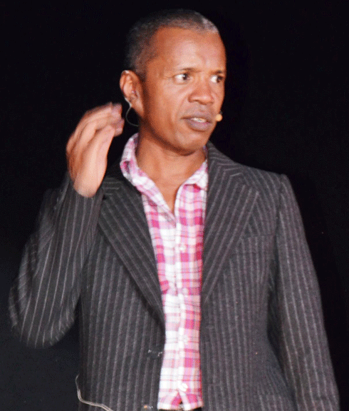

# Francis Turbo

Did you know that it was born, not in the Amoron'Imania region but in Sandrohy in Mananjary? That he became a dad again, at 50, but this time with twins? That he masters both official Malagasy as well as the Betsileo, Vezo, Tanosy or Antambahoaka dialects and that he is shy in nature? Portrait of a geographer, turned humorist.

Would he still have become so famous and sought after if he hadn't worn the same outfit during his first solo show? Even 25 years after his first show at Cemes Soanierana, people still remember the famous "milibandy" and his straw hat. With his quirky humor, often salty and his unusual stage outfits, Francis turbo marked the spirits and the humorous landscape with his imprint.

**Genre:** Tsapiky,slow,,,

**Artist homepage:** [Francis turbo](www.midi-madagascar.mg)
