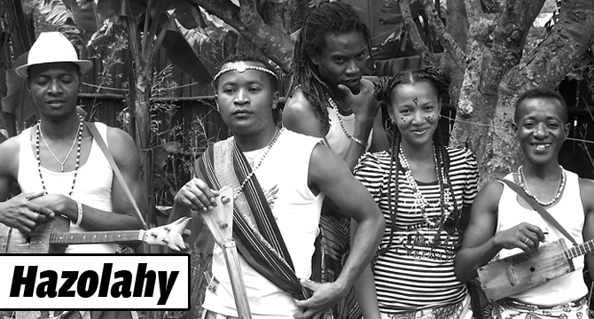

# Hazolahy

Hazolahy is a musical group from Madagascar that performs the traditional genre of *mangaliba* from the island's southeastern coast. The group's music occasionally integrates the vocal style of beko from the neighboring Antandroy region at the southern end of Madagascar. The founder of the group, Thominot Hazolahy, grew up among musicians and while still a student formed his first group, which performed a fusion of blues, mangaliba and reggae. His second group, Hazolahy, stays truer to the mangaliba genre. Hazolahy's music combines vocals, acoustic guitars and percussion, including large traditional drum of ritual significance which is itself called *hazolahy*.

**Genre:** Mangaliba

**Artist homepage:** [Archive.org: musiques-metisses/HAZOLAHY](https://web.archive.org/web/20131005062147/http://www.musiques-metisses.com/artiste/HAZOLAHY)
