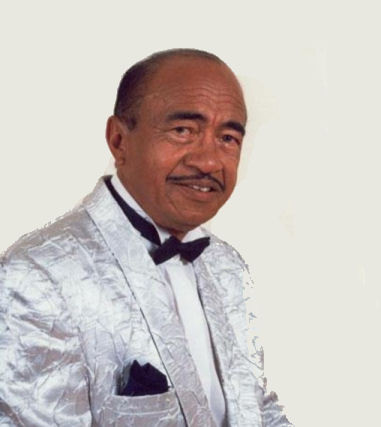

# Henri Ratsimbazafy

Henri Ratsimbazafy was born on 29 March 1933 in Ankadifotsy, Antananarivo, Madagascar.

He began his musical career in the 1950s.

It was not until ten years later that he made his first appearances on stage in 1960. Composer-songwriter, Henri Ratsimbazafy is also an interpreter.
He is the Malagasy artist with the greatest discography with at least two hundred works, mostly published in records.

**Genre:**

**Artist homepage:** [Discogs.com: Henri Ratsimbazafy](https://www.discogs.com/artist/3339774-Henri-Ratsimbazafy)
