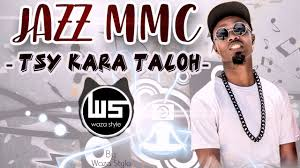

# Jazz mmc

This artist started in 2010 and became famous 2014

Jazz mmc is a malagasy artist and he is known as a king of Gweta also he is able to communicate with all of people.He was born in 03 december 1995 in Antsiranana(Diego suarez). His real name is MOHAMED Ibraim but he made his nickname "Jazz Makoa Mifangaro Culture" as a name of his brand.He was a member of "Team Doctor Scolo de Diego" when he was 11 years old.

**Genre:** Gweta Gasy,Waza made up of ragga and rap.

**Artist homepage:** [Jazz-mmc.com](https//www.jazz-mmc.google.com)
