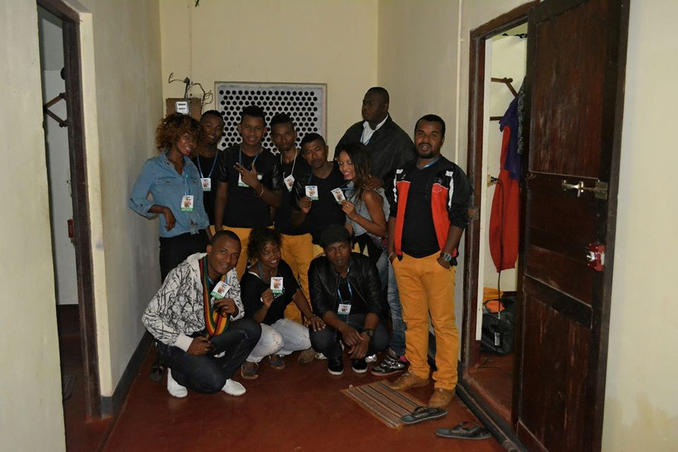

# Kapepeky

Kapepeky is a group musical whose interest is to make the Bassesa larovoko, which a traditional music originated in the Eastern of Madagascar, to be known over the world.
The group is led by Donatien and located in [Fenerive Est](https://en.wikipedia.org/wiki/Fenoarivo_Atsinanana) Analanjirofo region.

**Genre:** Bassesa larivoko, modern watsawatsa (Eastern Malagasy traditional music)

**Artist homepage:** [Kapepeky](https://web.facebook.com/Kapepeky-176953532458636/?_rdc=1&_rdr)
