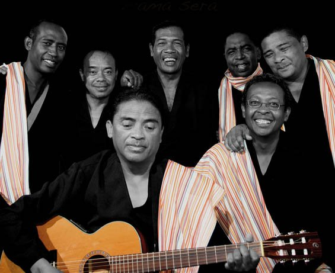

# Mahaleo

Mahaleo is a folk-pop band from Madagascar that is widely viewed as the most popular Malagasy group of all time. The band was founded by Dama (Rasolofondraosolo Zafimahaleo) with six of his classmates after first performing together during the rotaka student protests at their high school on 13 May 1972. Mahaleo's lyrics draw upon the indirect language of traditional hainteny and ohabolana (Malagasy poetry and proverbs) to expose contemporary political and social issues and invite listeners to identify their own solutions.

Source:[wikipedia](https://en.wikipedia.org/wiki/Mahaleo)

**Genre:** Folk pop

**Artist homepage:** [Mahaleo](https://www.youtube.com/channel/UCaQOWmY4aBPwTzsEJSUabZQ)
