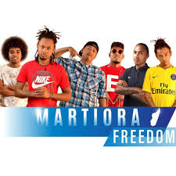

# Martiora Freedom

Martiora Freedom is a malagasy group, which was created in 2009 in Antananarivo. This is formed by five members : Tobi, Malm, Bomi, Tremai and Mafr (entered in 2013). This group started to sing in 2009 and became famous in 2012 with the first song << Hafa mihintsy >>. They released their first album in February 2013. On 7th November 2014, << Best Of Timoramar >> was released, the second album. Since 2015, this group reached their success untill now.

**Genre:** Rnb and Reggae root

**Artist homepage:** [Martiora Freedom](https://web.facebook.com/TioramarFianakaviana/?_rdc=1&_rdr)
