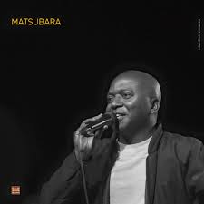

# Matsobara

Matsobara ethymogically comes from [Bara](https://en.wikipedia.org/wiki/Bara_people) which where the man comes from. He uses Mangaliba which is their traditional music and Folk for his songs.

**Genre:** Mangaliba, Folk

**Artist homepage:** [Matsobara](https://web.facebook.com/matsubara.madagascar/timeline?_rdc=1&_rdr)
