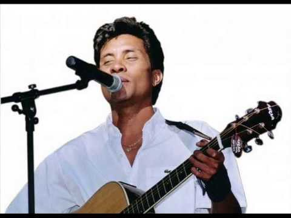

# Njakatiana

Njakatiana (his real name is Raharisoa Njakatiana) is a Malagasy singer, who was born on 07th june 1968. He started his career as a singer in 1992. He is one of the best Malagasy singer.

**Genre:** Salegy, Slow

**Artist homepage:** [Njakatiana](https://web.facebook.com/NJAKATIANA-53056251117/?_rdc=1&_rdr)
