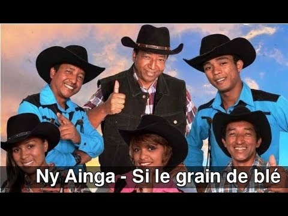

# Ny ainga

This artist started to sing in 1994 and became famous in 1995. There are five singers and six musicians in this musical group. Om'guy was the leader of this band, but he actually died in 2018. Since then, Luc is the name of the new leader of this group.

**Genre:** Country

**Artist homepage:** [Ny ainga](https://web.facebook.com/Tarika.Ny.Ainga/?_rdc=1&_rdr)
