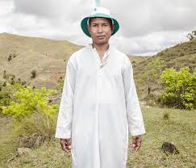

# Odet

MANGALAZA COMMUNE - Mr. Odet Rafaralahy works as cultural manager in the Alaotra Mangoro Regional Council. But above all, he is the president and founder of the ANTALAOTRA association, the largest cultural association in this part of Madagascar, whose mission is to promote and make known the rites, cults and traditions of the Alaotra Mangoro region, a sacred region according to Odet Rafaralahy. Created in 2014, the association already has 37,000 members. Most of them are Mpanazary that can be translated as spiritual guide, diviner, medium. The literal translation is "bewitching". The Mpanazary are almost considered as " demi-gods ". Their dreams, predictions and premonitions are respected and followed by the people of the region and even by the civil and administrative authorities. The region around Lake Alaotra (North-East of Madagascar) is one of the richest agricultural regions in Madagascar. It is considered the "rice granary" of the Big Island. Some argue without hesitation that it is because of the sacred character of the region and its particular cultural practices that the region is so prosperous. Today, as every year, the local population and some Mpanazary go to a sacred hill near the village of Mangalaza to invoke the spirits of the ancestors (Tromba) and ask Zanahary (animist Malagasy God) and Andriamanitra (Christian God) to kindly bring again the beneficial rains for next October that will grow the crops. Each Mpanazary has its specialty: some can bring rain, some can stop cyclones, others can drive out evil spirits. The patients take the opportunity to be treated by the Mpanazary-healer. .

**Genre:** jijy

**Artist homepage:** [odet](http://www.rijasolo.com)
