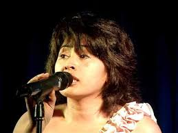

# Poopy

Poopy helped her aunt, Michelle, to the stage. She was just 15 years old. Two years later, in 1983, Njila's group of Poopy's friends sought out a female singer, and it was Poopy's father who first met Poopy and Njila, singing Jeanne Moreau's song Poopy At that, Njila was immediately taken captive and the group chose Njila as a group. In 1990, Njila's group moved to France, while Poop chose to stay in Madagascar. That's when he started singing solo (Solo). He worked with Solofo Ranarivelo and in 1990 released his first "Japan koa". Teo audiovisual trips on the water, "Gina Gina" In 1991, a stage which Poopy, Bodo, Thad And Susan, was well known that i "Hidden" Poopy and Bodo, a song composed by Poopy when he was in Njila's band, and" One Power "he sang with Luc and Mighty (Johary) and Bodo. He also started working with Naivo himself, and since then Poopy has created all of his musical tastes and Naivo has set his voice and cares about the art world. 1992Forbidden love, "which confirms the quality of the partnership between Poopy and Naivo. Ary In 1993 he released the album "Victory" and marked nihirany. Teo decade she came contrat with the BMG and went South Africa performed the "Rainbow Rainbow" album, and met Bonnie Tyler.

**Genre:** Pop

**Artist homepage:** [poopy](https://mg.wikipedia.org/wiki/Poopy)
