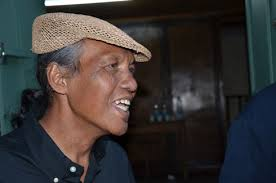

# Railola

This artist started singing after 1970 and became famous when he had released the song entitled "Ho avy ny maraina". He had that timbre of voice that moved his audience when he interpreted the great classics of the Railovy group. Railola was the worthy son of Jérôme Randria, mythical figure of the Malagasy song. He was dead in December 2013.

**Genre:** Slow and Gasigasy

**Artist homepage:** [Railola on facebook](https://web.facebook.com/railola.et?_rdc=1&_rdr)
