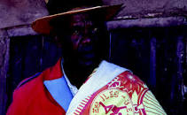

# Ramilison besigara

Ramilison Besigara (Ramilison "Mr. Many-Cigarettes"), also known as Dadamily Besigara, was a hiragasy troupe leader from Fenoarivo in the central highlands of Madagascar. His troupe, Tarika Ramilison Fenoarivo, featured his daughter, Perline, as a singer and dancer. Over two dozen singers, dancers and traditional musicians performed in the troupe. Tarika Ramilison Fenoarivo was in high demand to perform at famadihana reburial ceremonies and other traditional events in the highlands.

In addition to founding and leading his celebrated hiragasy troupe, in 2007 Ramilison co-founded the League of Madagascar, an association focused on popular education through the medium of the hiragasy, performing educational songs on such themes as health, environmental protection, birth control, and good governance. He served as President of the Confederation of Hiragasy Artists (FIMPIMAMAD), which organized and united several thousand hiragasy artists to lobby government for the promotion of their art. For his promotion of traditional arts, the Madagascar Ministry of Culture awarded him the Grand Cross, Second Class, Commander of the Malagasy National Order on 20 September 2007, marking the first time such an honor was bestowed upon a hiragasy artist.

**Genre:** Hiragasy

**Artist homepage:** [ramiliso-besigara](https://web.facebook.com/MalagasyAHOMalagasyISIKA/?_rdc=1&_rdr)
