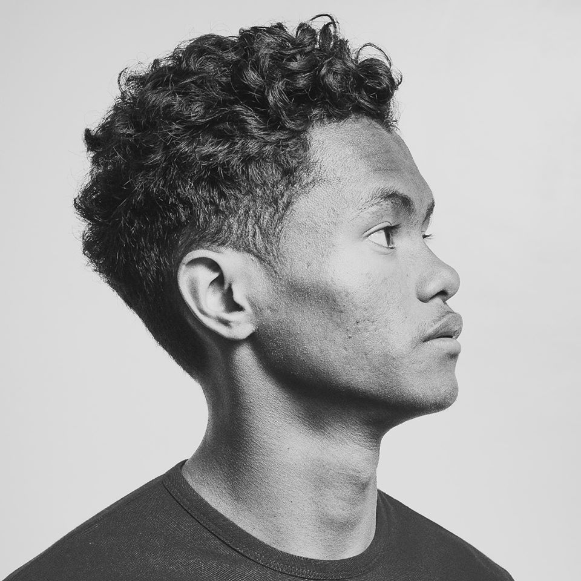

# Refano

Refano is a very young artist who rises from Vangaindrano, [Ihorombe region](https://en.wikipedia.org/wiki/Ihorombe) in the south of Madagascar. Everyone knew him after a duo with the singer Matsobara from whom is Refano's inspiration.

**Genre:** Folk

**Artist homepage:** [Refano](https://web.facebook.com/refanoofficial/)
