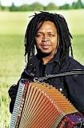

# Rossy

 Paul Bert Rahasimanana, better known as Rossy, is a Malagasy singer and songwriter, generally considered the most popular Malagasy artist of the 1990s. Beginning his musical career as an accordionist and singer within a traditional hira gasy musical troupe, Rossy innovated a fusion of hira gasy instrumentation and vocal style with contemporary rock, funk and folk sounds to create a uniquely Malagasy genre of contemporary popular music. Rossy actively promoted former president Didier Ratsiraka through concert performances throughout his presidency and served within the Ministry of Culture to promote artists' rights and copyright law. When Ratsiraka fell into disfavor following the contentious 2001 Malagasy presidential elections, Rossy went into self-imposed exile in France. He returned to the island to give concerts beginning in 2008 and enjoyed enormous popularity despite six years of absence, setting an unbroken record of 35,000 tickets sold for a performance given that year. His compositions and style are frequently associated with the Ratsiraka socialist period and commonly evoke a sense of nostalgia among Malagasy fans

**Genre:**  Hira gasy, Vakisôva, Tapolaka

**Artist homepage:**  [Rossy]https://web.facebook.com/GoRossy/?_rdc=1&_rdr
