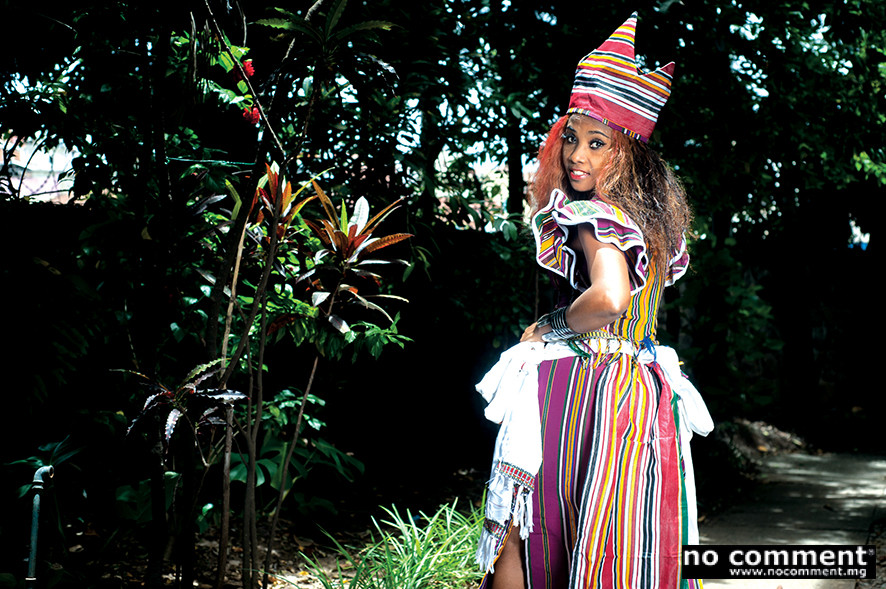

#  Sisca

She is the rising star of Malagasy tropical music. Her mogodro style, from modern salegy to fiery temperament, makes her a mafana value. His notoriety grew in Mayotte, in South Africa, and of course in his native country. 

Before being a shock shock singer, Sisca, whose real name is Francisca Razafy, is above all a young woman smiling and full of life. Who would have thought that this big fan of Céline Dion, member of a choir, would make the cabarets of the Big Island and elsewhere foam? “It all started in 2007, when I noticed that there were few women doing research on Salegy, a music that is of great interest to the international scene. " Sisca has tried several variations of the genre. A track like Atero zaho (Bring me back) is traditional, and Misonner libre rather reggae.“Sisca's music has changed a lot over the years. It went from Antosy, a fairly slow rhythm, to a hot boiling mogodro, via a salegy goma. It is in this genre that she made a female version of the famous Fandrama, " says Nelson Rafandroana, producer and collaborator of the singer.

**Genre:** salegy, antosy, slow

**Artist homepage:** [Sisca](
https://fr-fr.facebook.com/sisca.jobikelyvaleur)