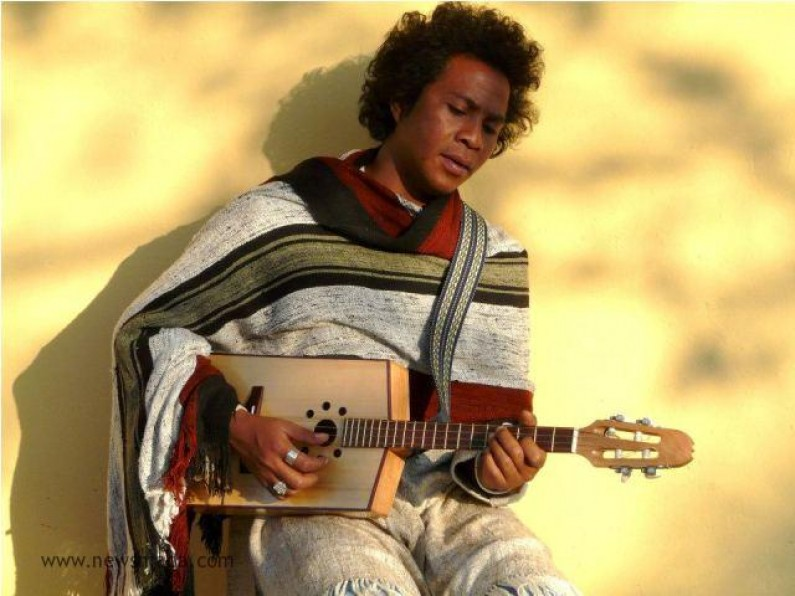

# Theo Rakotovao

The tenth child of a sibling who has thirteen, Theo Rakotovao was born on April 19, 1975 in Tanandava station, in south-west Madagascar. His paternal great-grandfather, whose name he still keeps, had settled in this region after having fled the Highlands of Grande Île during French colonization.

Théo Rakotovao and his group Mikea put Madagascar on the musical map in November 2008, carrying off RFI's "Découvertes" award. Ardent defenders of "beko", a traditional blues sound from southern Madagascar

**Genre:** Beko, tsapiky

**Artist homepage:** [Theo Rakotovao-Mikea](https://translate.google.com/translate?hl=en&sl=fr&u=https://musique.rfi.fr/artiste/mikea&prev=search)
