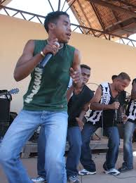

# Tsiliva

Tsiliva is a Maalagasy musician. Since he was a boy, he was interested in playing music and creating a song. After he got his Bacclaureat degree, he started to join in a group called Dadah De fort Dauphin. In 2004, he launched his career and produced his first song Oh! le Tsiliva. He started to sing with other singers such as Vaiavy Chilla and even went abroad for a performance.

**Genre:** Kilalaky, Raggae, Pop.

**Artist homepage:** [tsiliva](https://en.wikipedia.org/wiki/Tsiliva)
