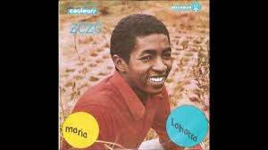

# Zeze Mahanoro

This artist started in 2006 and become famous in 2010.

Zeze Mahanoro was a malagasy artist and known as a king of basesa. He was born in Toamasina.His real name is Elizee Andre Randriantsalama but he made his nickname Zeze Mahanoro because basesa music is originally from Mahanoro. He passed away in 2014.

**Genre:** Basesa
**Artist homepage:**[Zeze Mahanoro](https://www.zeze-mahanoro.google.com)
